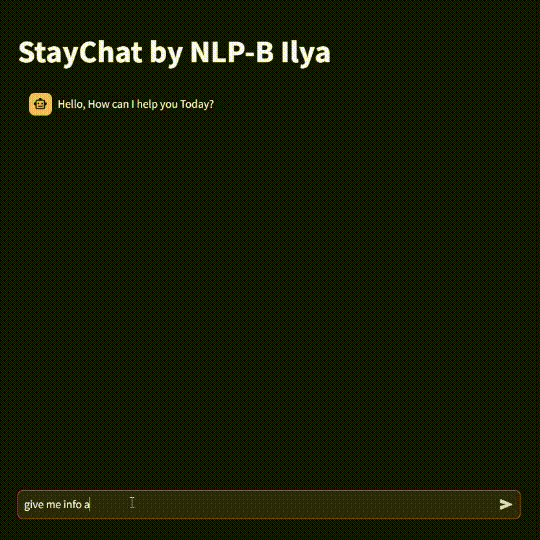

# StayChat LLM RAG Chatbot

Here is the presentation (GIF with 5 sec interval)

## StayChat Demo
Based on the best performing LLM RAG in the experiments of this project, we created a demo for StayChat as a proof-of-concept:

## StayChat Exploratory Data Analysis (EDA) Summary

### Hotel Recommender / HotelWatch System: Exploratory Data Analysis
The StayChat_EDA notebook provides an in-depth exploratory data analysis (EDA) of the StayChat dataset, focusing on understanding user behavior, identifying trends, and extracting insights to enhance the chat application's user experience.

#### Key Sections and Findings

- **Descriptive Statistic Analysis**
  - **Key Findings:**
    - Detailed statistical analysis of key features, providing summary statistics and distribution plots.
    - Example: The most frequent data for `Hotel_Name` is "Britannia International Hotel Canary Wharf".

- **Categorizing Reviewer_Score (Binning)**
  - **Key Findings:**
    - Reviewer scores were categorized into bins to facilitate segmentation and analysis.
    - Example: Analysis identified specific score ranges for better understanding of review distributions.

- **General Analysis**
  - **Key Findings:**
    - Insights into user behavior, including overall activity patterns and engagement metrics.
    - Example: Average `Reviewer_Score` is 8.4 with a standard deviation of 1.64.

- **Regional Analysis**
  - **Key Findings:**
    - Regional segmentation of data to understand user behavior across different geographic locations.
    - Example: Most frequent reviewer nationality is "United Kingdom".

- **Review Analysis**
  - **Key Findings:**
    - In-depth analysis of user reviews to identify common themes, sentiments, and areas for improvement.
    - Example: Common phrases in positive reviews include "No Negative".

## StayChat LLM Explore

The StayChat_LLM_Explore notebook details the exploration of implementing RAG in 2 LLM models ChatGPT (OpenAI) and Phi3 (Microsoft).

 - ChatGPT + Retriever
 - Phi3 + Retriever
 - ChatGPT + Retriever + Online Search
 - Other experiments
Based on the experiments, we found that the most reliable LLM Models for this project is indeed ChatGPT, in this case the GPT-3.5-Turbo.
